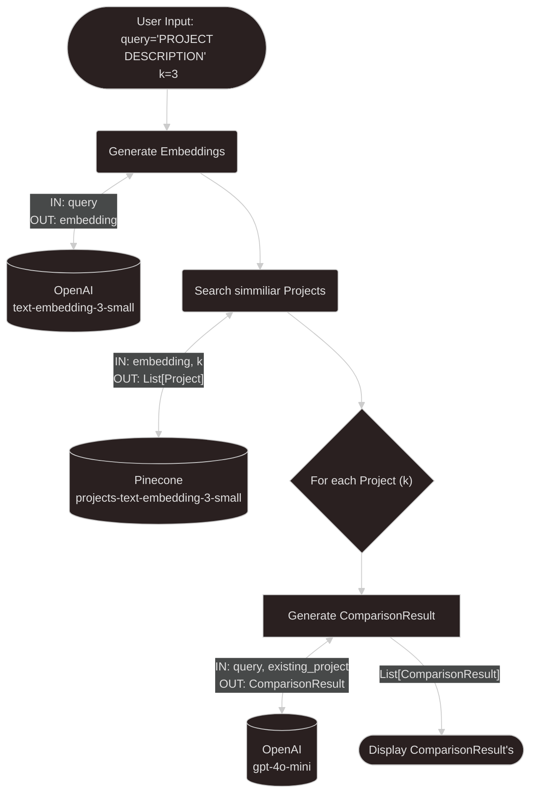

# Horizon Match

An application for comparing project ideas using vector search and gpt-4o-mini.

```mermaid
---
config:
  theme: neo-dark
---

flowchart TD
    A(["User Input: <br> query='PROJECT DESCRIPTION' <br> k=3"]) --> B("Generate Embeddings")
    B <-- IN: query <br> OUT: embedding --> X_B[("OpenAI <br> text-embedding-3-small")]
    B --> C("Search simmiliar Projects")
    C <-- IN: embedding, k <br> OUT: List[Project] --> X_C[("Pinecone <br> projects-text-embedding-3-small")]
    C --> D{"For each Project (k)"}
    D --> E["Generate ComparisonResult"]
    E <-- IN: query, existing_project <br> OUT: ComparisonResult --> X_E[("OpenAI <br> gpt-4o-mini")]
    E -- List[ComparisonResult] --> F(["Display ComparisonResult's"])


```

